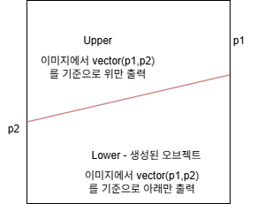

# SliceRenderer

---

경로 : Components/Rendering/SliceRenderer

상속 : RenderComponent

## 설명

ID2D1PathGeometry 통해 만든 기하 도형으로 클리핑한 이미지를 생성하는 함수

Sutherland–Hodgman Polygon Clipping 알고리즘을 사용해서 만듦

### 원리



## 예시 코드 - 마우스의 위치 값을 이용해 이미지 자르는 코드 일부

```cpp
void SliceObject::HandleOverlap()
{
	D2D1_MATRIX_3X2_F mat = owner->GetTransform().GetFinalMatrix();	// Unity 좌표계를 고려해 매트릭스 값 가져오기
	Vector2 currentPosition = { mat.dx , mat.dy }; // 위치 값을 Vector2로 변경

	if (IsOverlap(Input::MouseX, Input::MouseY))
	{
		if (state == OverlapState::Notyet) // 충돌 전
		{
			state = OverlapState::Processing;	// 상태 변경 -> 충돌 중
			startVec = { Input::MouseX, Input::MouseY };			
			startVec.x -= mat.dx;
			startVec.y -= mat.dy;

			startVec = ClampPoisiton(startVec); // 위치 보정
		}
	}
	else
	{
		if (state == OverlapState::Processing) // 충돌 중일 때 충돌이 종료됨
		{
			state = OverlapState::End;	// 상태 변경 -> 충돌 종료
			endVec = { Input::MouseX, Input::MouseY };
			endVec.x -= mat.dx;
			endVec.y -= mat.dy;

			endVec = ClampPoisiton(endVec); // 위치 보정

			GameObject* obj = sliceComp->Slice(startVec, endVec); // 갱신된 위치를 가지고 slice함수 실행

			// 짤린 오브젝트가 생성되었음
			if (obj != nullptr)
			{
				Singleton<SceneManager>::GetInstance().GetCurrentScene()->AddGameObject(obj); // 해당 오브젝트를 씬에 추가해서 실행
				auto rigid = obj->AddComponent<Rigidbody2D>();

				// comp->SetGravity(true);
				 
				obj->AddComponent<SliceObject>();
				auto mono = obj->GetComponent<SliceObject>();
				state = OverlapState::Notyet;	// 다시 자를 수 있게 상태 변경 -> 충돌 전
			}
		}
	}
}
```

### SliceBitmapInfo - 비트맵을 추가 설정하기 위한 구조체

| 이름 | 내용 |
| --- | --- |
| position | 이미지 출력 위치 |
| dirVec | 이동 방향 |
| speed | 속도 |
| capacity | 투명도 |

### ClipEdge - Vector2 두 개를 묶은 구조체

| 이름 | 내용 |
| --- | --- |
| p1 | vector2 좌표 값 |
| p2 | vector2 좌표 값 |

## 멤버 함수

### public

| 이름 | 내용 |
| --- | --- |
| SetOriginalByPath | 경로를 통해 비트맵 이미지 가져오는 함수 |
| SetOriginalByBitmap | 비트맵을 통해 비트맵을 설정하는 함수 |
| GetOriginal | 해당 컴포넌트가 가지고 있는 비트맵을 반환하는 함수 |
| SetPoint | 꼭짓점 위치 값 설정함수 ( 사용 시 현재 vector 컨테이너 내용을 덮어씀 ) |
| Slice | 해당 컴포넌트의 이미지를 자르고 잘린 부분을 출력하는 오브젝트를 반환하는 함수 |
| CreateGeomatryByPolygon | 좌표값들로 기하학 도형을 생성하는 함수 |
| ClipPolygon | subjectPolygon의 좌표점으로 만들어진 도형을 edge 값을 이용해 짜르는 함수 |
| GetIntersection | clipEdge에 교차하는 end - start 벡터에 대한 교차 비를 통해 startVec을 edge벡터까지 이동시킨 결과값을 반환하는 함수 |
| SetPosition | 이미지 로컬 좌표 설정 함수 |
| SetDirection | 이미지 로컬 회전 설정 함수 |
| SetSpeed | 속도 설정 함수 - 중력 흉내내는 등 사용할 때  |
| GetInfo | SliceBitmapInfo 반환 함수 |
| GetSize | 현재 클립핑한 이미지의 크기를 반환하는 함수 |

### private

| 이름 | 내용 |
| --- | --- |
| IsInside | cross product를 이용해 해당 점 p가 edge보다 위에 있는지 확인하는 함수 |
| NearlyEqual | 두 float값이 유사한지 확인하는 함수 |

## 멤버 변수

| 이름 | 내용 |
| --- | --- |
| originBitmap | 원본 비트맵 |
| pathGeometry | 클립핑한 기하 도형  |
| infos | sliceBitmapInfo 내용 |
| points | Sutherland–Hodgman Polygon Clipping 알고리즘에 따라 나온 각 꼭짓점 위치 값들 |
| pSink | 기하도형을 그리는 ID2D1GeometrySink |